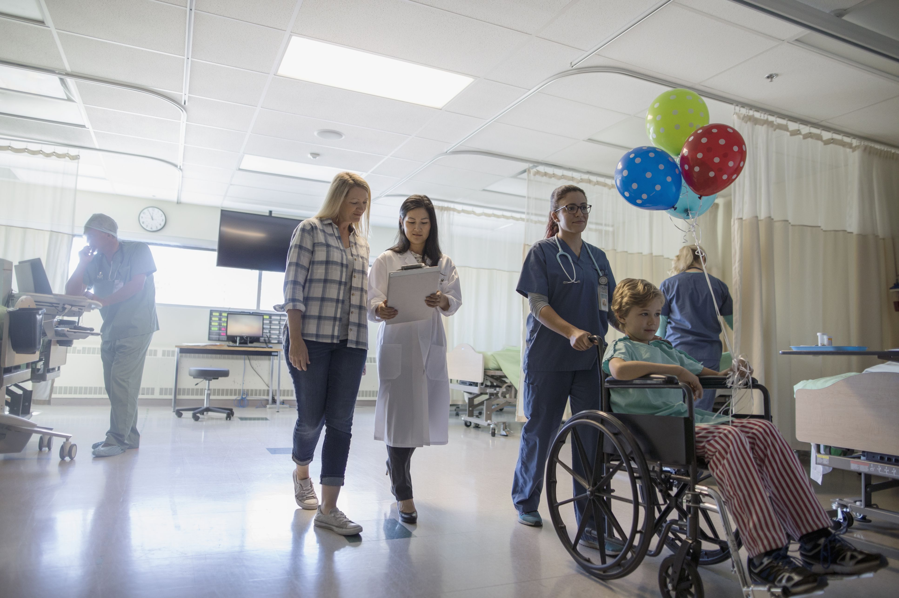

# Table of Contents

* <a href="#intro">Introduction</a>
* <a href="#characterize">Data Characterization</a>
* <a href="#tidying">Tidying The Data</a>
* <a href="#lit">Literature Review</a>
* <a href="#sub">Subanalyses</a>
* <a href="#regress">Regression Analysis</a>
* <a href="#conclusion">Discussion</a>
* <a href="#changes">Changes Mid-Report</a>
* <a href="#refs">References</a>

---

### Authors

* Katherine Dimitripoulou PhD (UNI: kd2524)
* Jerri Chen MD, PhD (UNI: jc4166)
* Lisa Eisler MD (UNI: ldl2113)

<h1 id="intro">Introduction</h1>

Insert Intro
<sup>[1](https://www.flintrehab.com/2019/cerebral-palsy-scoliosis/)</sup>

## Project Motivation


## Project Roadmap


<h1 id="characterize">Data Characterization</h1>

```{r setup, message=FALSE, warning=FALSE}
library(tidyverse)
library(haven)
library(plotly)
library(viridis)
# Formatting plot output
knitr::opts_chunk$set(
  out.width = "90%"
  )
# Set the plot design
theme_set(theme_classic() + 
            theme(legend.position = "bottom", 
                  legend.key.size = unit(1.5, "line"),
                  plot.title = element_text(hjust = 0.5)))
# Raw data
nsqipspineCP_1617 = read_csv("./data/nsqipspineCP_1617.csv")
```

In its raw form, the data has `r nrow(nsqipspineCP_1617)` rows and `r ncol(nsqipspineCP_1617)` columns. Each row corresponds to a single spinal fusion and 384 demographic, medical, surgical, and pre/intra/postoperative characteristics and events, which required a massive amount of chart review by a clinical reviewer.

A copy of the data could not be shared due to licensing agreements.

This is a focused analysis, interested only in a handful of important postoperative outcomes as they relate to the recovery of CP patients undergoing spinal fusion. These variables are defined here: (FROM JERRI)

Therefore we will tidy the data to that end.

<h1 id="tidying">Tidying the Data</h1>

## Data Reduction & Cleaning

To start the cleaning, we replaced the value "-99" with NA to indicate non-zero missingness. We converted age in days to age in years and height and weight to the metric system. We then created a BMI estimate based on height and weight. American Society of Anesthesiologists Physical Status Classification (ASA Class) was converted from a character variable to a factor variable. A dichotomous variable indicating whether the patient returned home or was discharged to a facility was created and null values deleted. A subset of the data was selected for analysis.

```{r, message=FALSE, warning=FALSE}
cp_spine_tidy = nsqipspineCP_1617 %>%
  mutate_if(is.numeric, ~replace(., . == -99, NA)) %>%
  mutate(
    age_years = age_days/365.25,
    height = height*2.54,
    weight = weight/2.2) %>%
  mutate(
    bmi = weight/((height/100)*(height/100)),
    asa_status = case_when(
      asaclas == "ASA 1 - No Disturb" ~ "1",
      asaclas == "ASA 2 - Mild Disturb" ~ "2",
      asaclas == "ASA 3 - Severe Disturb" ~ "3",
      asaclas == "ASA 4 - Life Threat" ~ "4",
      asaclas == "None assigned" ~ "NA"),
    home_discharge = case_when(
      dischdest == "Expired" ~ "FALSE",
      dischdest == "Facility Which was Home" ~ "TRUE",
      dischdest == "Home" ~ "TRUE",
      dischdest == "Rehab" ~ "FALSE",
      dischdest == "Separate Acute Care" ~ "FALSE",
      dischdest == "Skilled Care, Not Home" ~ "FALSE",
      dischdest == "Unknown" ~ "NA",
      dischdest == "Unskilled Facility Not Home" ~ "FALSE",
      dischdest == "NULL" ~ "NA"
    )) %>%
  filter(home_discharge != "NA") %>% 
  select(pufyear_x:ped_spn_post_neurodeftype, age_years, sex, height, weight, bmi, ethnicity_hispanic, race, asa_status, transt, ventilat, asthma, hxcld, oxygen_sup, crf, impcogstat, seizure, nutr_support, hemodisorder, optime, tothlos, d_opto_dis, death30yn, supinfec, wndinfd, orgspcssi, dehis, oupneumo, pulembol, renainsf, urninfec, cszre, neurodef, cdarrest, othbleed, bleed_ml_tot, othcdiff, othsysep, unplannedreadmission1, reoperation, dischdest, home_discharge)
```

